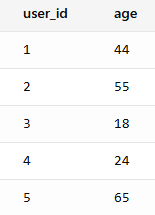

# Покупки магазина

Инструменты: SQL, Seaquel.

## Файлы

В проекте содержатся следующие файлы:

- create_table_purchases.sql - создание таблиц базы данных
- quary_of_purchases.sql - sql-запросы

## Создание таблиц

Для базы данных созданы три таблицы: Users, Purchases, Items.

В таблице Users созданы поля с идентификатором пользователя и возрастом.
CREATE TABLE Users(
  user_id INTEGER PRIMARY KEY AUTOINCREMENT,
  age INTEGER
);

В таблице Purchases созданы поля с идентификаторами покупки, пользователя, товара и датой покупки.
CREATE TABLE Purchases(
  purchase_id INTEGER PRIMARY KEY AUTOINCREMENT,
  user_id INTEGER NOT NULL,
  item_id INTEGER NOT NULL,
  date DATE,
  FOREIGN KEY (user_id) REFERENCES Users (user_id)
  ON DELETE CASCADE,
  FOREIGN KEY (item_id) REFERENCES Items (item_id)
  ON DELETE CASCADE
);

В таблице Items созданы поля с идентификатором товара и ценой.
CREATE TABLE Items(
  item_id INTEGER PRIMARY KEY AUTOINCREMENT,
  price double
);

Поля user_id и item_id связывают между собой таблицы базы данных.

## Заполнение таблиц

Таблица Users заполнена данными с возрастом, идентификатор пользователя заполняется автоматически.
INSERT INTO Users(age)
VALUES (44), (55), (18), (24), (65);

    

Таблица Items заполнена данными с ценами, идентификатор товара заполняется автоматически.
INSERT INTO Items(price)
VALUES (215.0), (100.0), (25.0), (355.0), (50.0), (35.0), (270.0);

    

Таблица Purchases заполнена данными с идентификаторами пользователя и товара, а также датой покупки, идентификатор покупки заполняется автоматически.
INSERT INTO Purchases(user_id, item_id, date)
VALUES
  (1, 6, "2024-01-15"), 
  (2, 1, "2024-01-03"), 
  (3, 6, "2024-02-10"),  
  ...
  (4, 2, "2024-11-28"), 
  (4, 3, "2024-12-21"), 
  (5, 4, "2024-12-08");

    

## SQL-запросы

В файле purchase_queries.sql содержатся запросы для поиска данных по вопросам.

1) Какую сумму в среднем в месяц тратят пользователи в возрастном диапазоне от 18 до 25 лет включительно
SELECT strftime('%m', date) AS month, AVG(price) AS avg_by_month
FROM Purchases p
LEFT JOIN Items i
  ON p.item_id = i.item_id
LEFT JOIN Users u
  ON p.user_id = u.user_id
WHERE age >= 18 AND age <= 25
GROUP BY strftime('%m', date);

    

1) В каком месяце года выручка от пользователей в возрастном диапазоне 35+ самая большая
SELECT strftime('%m', date) AS month, SUM(price) AS revenue
FROM Purchases p
LEFT JOIN Items i
  ON p.item_id = i.item_id
LEFT JOIN Users u
  ON p.user_id = u.user_id
WHERE age > 35
GROUP BY strftime('%m', date)
ORDER BY SUM(price) DESC
LIMIT 1;

    

1) Какой товар дает наибольший вклад в выручку за последний год
SELECT item_id, item_revenue
FROM (
  SELECT item_id, 
         SUM(price) AS item_revenue, 
         RANK() OVER (ORDER BY SUM(price) DESC) AS top_rev
  FROM Items
  GROUP BY item_id
)
WHERE top_rev = 1;

    

1) Топ-3 товаров по выручке и их доля в общей выручке
SELECT item_id,
       share
FROM (
  SELECT item_id, 
       share,
       RANK() OVER (ORDER BY share DESC) AS top_rev
  FROM (
    SELECT item_id, 
           ROUND(SUM(price) OVER (PARTITION BY item_id) / SUM(price) OVER (), 3) AS share
    FROM Items
  ) 
)
WHERE top_rev <= 3;

    

## Выводы

В данном проекте созданы таблицы, после чего они заполнены соответствующими данными. Для ответов на поставленные вопросы созданы SQL-запросы. 
